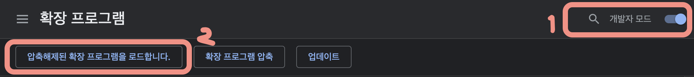
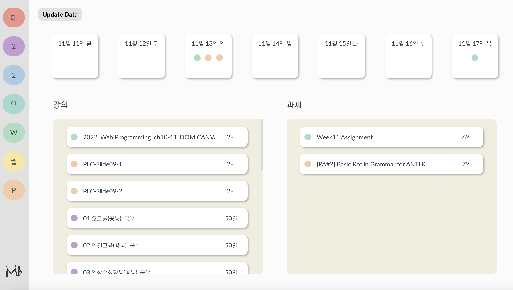
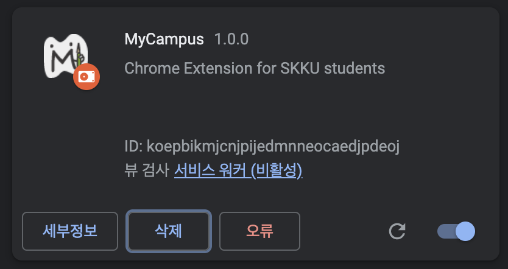

# Beta-test Guideline

생성일: 2022년 11월 11일 오후 3:38

# 설치
1. 현재 디렉토리에 있는 `dist.zip`을 다운로드 받아서 압축해제 해주세요.
2. `chrome://extensions` 링크에 접속해주세요.
3. 개발자 모드 켜고 `압축 해제된 확장 프로그램 로드` 클릭후, 1에서 다운로드 받은 `dist` 폴더를 업로드 하면 됩니다.
    
    
    
<br/>

# 사용 및 기능 설명

아이캠퍼스에 접속하고 로그인 하면 자동으로 `mycampus`가 화면에 뜹니다.

```
❓ 아이캠퍼스에 접속하였는데 `mycampus`화면이 뜨지 않고 새로운 탭이 열린 후 `canvas.skku.edu/courses/${courseId}/external_tools/5` 링크가 실행된다면 해당 탭을 닫고 아이캠퍼스 페이지를 새로고침 해주세요.
아이캠퍼스에서 사용하는 쿠키를 얻기 위한 과정인데, 조금 불편한 과정일거라 생각됩니다. 실제 배포버전에선 수정할 수 있도록 하겠습니다. 🙂
```

```
📌 반응형 디자인을 적용하지 않아 작은 화면에서 볼 시에 UI가 깨질 수 있습니다.
```

## Dashboard

데이터가 로드되면, 다음과 같은 화면을 보실 수 있습니다.



- 사이드바
    
    원하는 과목으로 이동할 수 있습니다. 하단의 mycampus로고는 해당 화면으로 다시 돌아오는 버튼입니다.
    
- Update Data 버튼
    
    모든 데이터를 다시 불러올 수 있는 버튼입니다. (새로고침 버튼을 이용하여도 모든 데이터를 새로 불러올 수 있습니다)
    
    ```
    📌 모든 데이터를 불러오기위해 시간이 많이 소요되어서 원하는 부분만 로드할 수 있는 기능을 개발중에 있습니다. 참고해주시면 감사하겠습니다! 🙂
    ```
    
- 날짜 카드
    
    오늘 날짜를 시작으로 하여, 일주일동안 수강 / 제출 해야 하는 강의 및 과제 개수 및 과목 정보를 확인 할 수 있는 카드 입니다.
    
- 강의 / 과제 리스트
    
    모든 과목을 대상으로 수강 / 제출해야 하는 강의 및 과제 리스트 입니다. 각 카드를 누르면 수강 / 제출 할 수 있는 페이지로 이동할 수 있습니다.
    

## 과목 페이지

: 자세한 설명은 생략하고, 참고해주셨으면 하는 부분들만 명세하겠습니다.

### 탭 이동

- 어떤 과목에서 공지사항을 확인하다가, 다른 과목으로 이동하면 동일하게 공지사항 탭으로 이동하도록 구현하였습니다. (항상 대시보드 탭으로 이동하지 않습니다)

### 대시보드

- 메모
    
    사용자가 원하는 메모를 추가할 수 있는 기능입니다. 아직 편집 / 삭제 기능은 구현 하지 못하였습니다.
    

### 공지사항

- 강의 컨텐츠에 Text 형태로 올라와있는 내용, 공지사항 탭에 올라와있는 항목들을 한번에 확인하실 수 있습니다.
- 공지사항 탭에 올라와있는 항목들의 경우, 항목을 클릭하면 해당 공지사항의 댓글을 확인할 수 있는 `댓글`버튼이 추가되어 있습니다.

### 강의

- 강의 목록, 스트리밍 녹화 강의 목록을 확인하실 수 있습니다.
    
    ```
    📌 아직 미완성된 페이지 입니다. 추후 북마크, 체크 기능과 해당 강의의 주차 정보를 추가할 예정입니다.
    ```
    

### 과제

- 과제 및 퀴즈 항목들을 확인하실 수 있고, 항목을 누르면 아이캠퍼스 상에서 해당 링크로 이동하실 수 있습니다.

### 자료실

- 강의 컨텐츠에 올라와있는 pdf, 자료실에 올라와있는 모든 항목들을 한눈에 확인하실 수 있습니다.
    ```
    📌 개별 자료를 다운 받을 수 있도록하는 기능을 개발중에 있습니다!
    ```
    
<br/>

# 피드백 해주셨으면 하는 내용

1. 저희가 미리 적어둔 부분 외 불편한 사항
2. 추가되면 유용하게 사용할 수 있을 것 같은 기능
3. 데이터 누락된 부분 : 어떤 데이터인지 말씀해주세요! (ex. 강의 콘텐츠에 Text형태로 올라온 데이터가 공지사항에 반영되지 않았습니다)
4. 이 외에도 어떤 피드백이든 환영입니다! 😀

```
🔥 에러가 발생했을 때 (갑자기 작동이 중지되거나 기존 icampus 대시보드 화면이 뜰 때) `chrome://extensions`에 접속하셔서 아래 이미지와 같이 MyCampus에 `오류`버튼이 생겼는지 확인해주세요. 확인 후 에러가 발생한게 맞다면, 콘솔이나 오류 버튼을 누르셔서 오류 확인 후 에러 메세지 및 오류가 난 상황을 알려주시면 감사하겠습니다!
```



</aside>